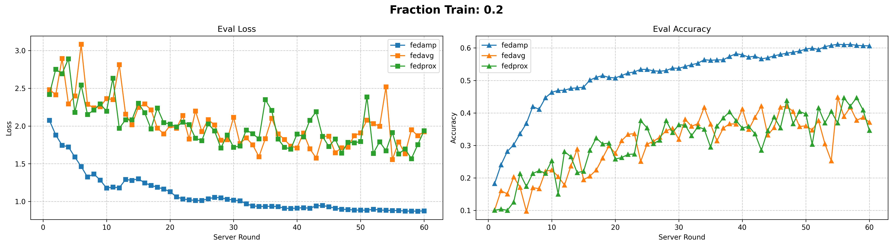
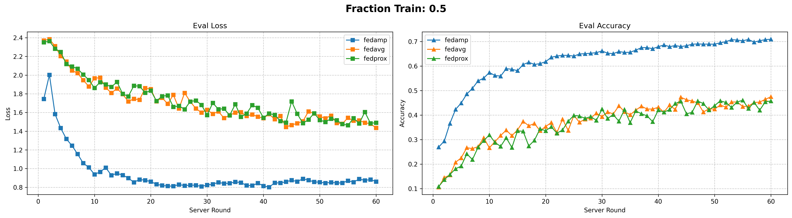
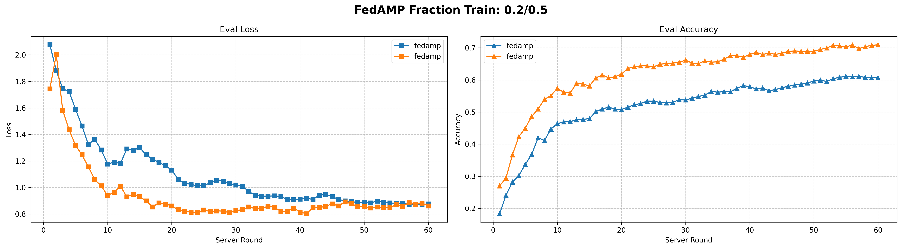
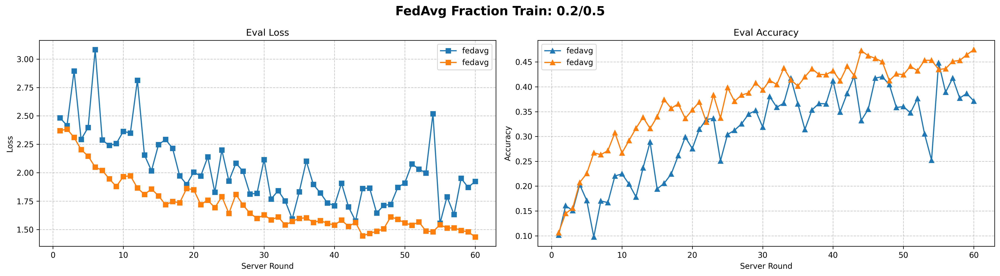
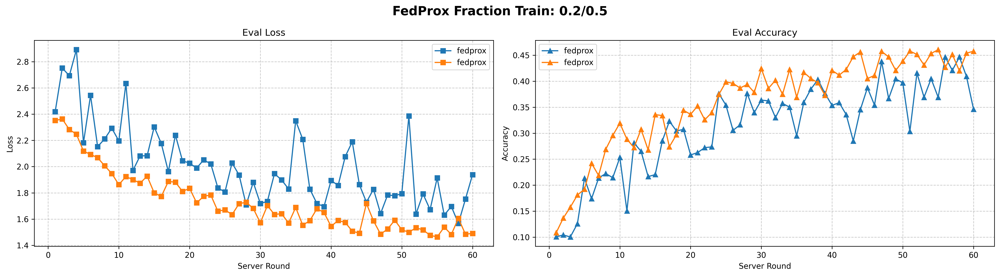

# FedAMP: Personalized Cross-Silo Federated Learning on Non-IID Data.

> [!NOTE] 
> If you use this baseline in your work, please remember to cite the original authors of the paper as well as the Flower paper.

**Paper:** : [https://arxiv.org/abs/2007.03797](https://arxiv.org/abs/2007.03797)

**Authors:** : Yutao Huang, Lingyang Chu, Zirui Zhou, Lanjun Wang, Jiangchuan Liu, Jian Pei, Yong Zhang

**Abstract:** : Non-IID data present a tough challenge for federated learning. In this paper, we explore a novel idea of facilitating pairwise collaborations between clients with similar data. We propose FedAMP, a new method employing federated attentive message passing to facilitate similar clients to collaborate more. We establish the convergence of FedAMP for both convex and non-convex models, and propose a heuristic method to further improve the performance of FedAMP when clients adopt deep neural networks as personalized models. Our extensive experiments on benchmark data sets demonstrate the superior performance of the proposed methods.


## About this baseline

**What’s implemented:** : The code in this directory implements the algorithm in *Personalized Cross-Silo Federated Learning on Non-IID Data* (Huang et al., 2021) for CIFAR-10 dataset under pathological sampling. It evaluates the performance under fraction-train of 0.2 and 0.5 against FedAvg and FedProx. 

**Datasets:** : CIFAR-10

**Hardware Setup:** : These experiments were run on a Tesla T4 GPU with 16 GB VRAM provided through Google colab session with GPU enabled. The total time for a single experiment with 20% pariticpation is ~20 minutes and 50% participation is ~40 minutes. 

**Contributors:** : [Kireeti](kir-7)

## Experimental Setup

**Task:** : Image classification

**Model:** : The default CNN model is used for all experiments (see `model.py   `).

**Dataset:** : This baseline includes CIFAR-10 dataset. It will be partitioned into 40 clients following a pathological split where each client has examples of three (out of ten) class labels. The settings are as follows:

| Dataset | #classes | #rounds | #partitions |     partitioning method     |  partition settings  |
| :------ | :------: | :-----: | :---------: | :-------------------------: | :------------------: |
| CIFAR-10   |    10    |   60   |    40    | pathological | 3 classes per client |

**Training Hyperparameters:**
The following table shows the main hyperparameters for this baseline with their default value (i.e. the value used if you run `flwr run .` directly)

| Description         | Default Value                                      | Note |
| ------------------- | -------------------------------------------------- |-------
| total clients       | 40                                                 | Since the algorithm is cross-silo algorithm.
| clients per round   | 8                                                   | This is set using fraction-train default=0.2
| number of rounds    | 60                                                | --
| client resources    | {'num_cpus': 2.0, 'num_gpus': 0.2}                | By default GPU is used, if CPU-only experiments, then set 'num-gpus'=0.0
| data partition      | pathological sampling (3 classes per client) | 
| optimizer           | SGD with proximal term                             |
| proximal mu         | 0.6                                                | Used for comparison experiment against FedProx
| fedamp_lambda | 1.0                                                | Used in combination with alphaK for the proximal weight
| sigma | 1.0                                                |  Used to calculate the cosine similarity (see `strategy.py` line `304`)
| alphaK | 1.0                                                | Used in combination with fedamp_lambda for the proximal weight

**Configurations:**

The following table shows the configurations to be set in `pyproject.toml` for different experiments

|  config.algorithm  | config.fraction-train |   config.num-server-rounds | options.num-supernodes |
| :--------------------: | :------------------------------: | :----------------------: | :--------------------: |
|   `fedamp`   |                0.2/0.5                |            60           |          40          |
| `fedavg` |                0.2/0.5                |            60           |          40       |
| `fedprox` |                0.2/0.5                |            60           |          40          |


## Environment Setup


## Environment Setup

```bash
# Create the virtual environment
pyenv virtualenv 3.12.12 fedamp

# Activate it
pyenv activate fedamp

# Install the baseline
pip install -e .
```

## Running the Experiments

To run this FedProx, first ensure you have activated your environment as above, then:

```bash
flwr run .  # this will run using the default settings in the `pyproject.toml`

# you can override settings directly from the command line
flwr run . --run-config "algorithm.mu=2 dataset.mu=2 algorithm.num_server_rounds=200" # will set proximal mu to 2 and the number of rounds to 200

# if you run this baseline with a larger model, you might want to use the GPU (not used by default).
# you can enable this by overriding the federation config. For example
# the below will run the server model on the GPU and 4 clients will be allowed to run concurrently on a GPU (assuming you also meet the CPU criteria for clients)
flwr run . gpu-simulation
```

To run using FedAvg:

```bash
# this will use a variation of FedAvg that drops the clients that were flagged as stragglers
# This is done so to match the experimental setup in the FedProx paper
flwr run . --run-config conf/mnist/fedavg_sf_0.9.toml  # MNIST dataset
flwr run . --run-config conf/femnist/fedavg_sf_0.9.toml  # FEMNIST dataset
```


## Running the Experiments


```bash
# command to run FedAvg experiment with 50% participation.
flwr run . --run-config "algorithm='fedavg' fraction-train=0.5 batch-size=32 lr=0.01 proximal_mu=0.0 save-dir='fedavg_results/'" --stream

# command to run FedAvg experiment with 20% participation.
flwr run . --run-config "algorithm='fedavg' fraction-train=0.2 batch-size=32 lr=0.01 proximal_mu=0.0 save-dir='fedavg_results/'" --stream


# command to run FedAMP experiment with 50% participation.
flwr run . --run-config "algorithm='fedamp' fraction-train=0.5 lr=0.01 batch-size=32 alphaK=1.0 fedamp-lambda=1.0 sigma=1.0 save-dir='fedamp_results/'" --stream

# command to run FedAMP experiment with 20% participation.
flwr run . --run-config "algorithm='fedamp' fraction-train=0.2 lr=0.01 batch-size=32 alphaK=1.0 fedamp-lambda=1.0 sigma=1.0 save-dir='fedamp_results/'" --stream


# command to run FedProx experiment with 50% participation.
flwr run . --run-config "algorithm='fedprox' fraction-train=0.2 lr=0.01 batch-size=32 proximal_mu=0.6 save-dir='fedprox_results/'" --stream

# command to run FedProx experiment with 20% participation.
flwr run . --run-config "algorithm='fedprox' fraction-train=0.2 lr=0.01 batch-size=32 proximal_mu=0.6 save-dir='fedprox_results/'" --stream


```

## Expected results

After running the above commands, the results should be stored in respective folder (`fedavg_results` / `fedprox_results` / `fedamp_results`) in json format containing training history. These are plotted using utility functions provided in `utils.py`. The plots that would be generated are shown below.

Results for comparison of all three algorithms for fraction-train = 0.2:



Results for comparison of all three algorithms for fraction-train = 0.5:



Results for FedAMP comparison on fraction-train:



Results for FedAvg comparison on fraction-train:



Results for FedProx comparison on fraction-train:


